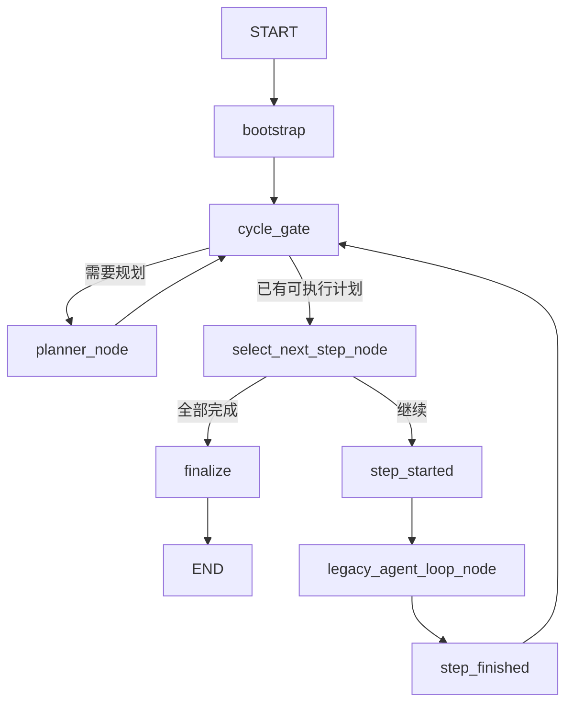

# Agent Graph v0

## 定位

`AgentGraphEngine` 是现有 Agent 外层执行循环的 LangGraph 等价实现。它继续实现
`AgentEngine.execute(request, context, emit) -> EngineResult`，因此 Web、CLI、Daemon、
session memory 和 trace 不需要了解内部图结构。

Graph v0 只迁移编排，不改变 Planner、Selector、ReAct、Signal、SubAgent、Prompt、
工具调用或最终汇总。完整 ReAct `while` 暂时作为一个 legacy 节点运行。

## 执行链路



`cycle_gate` 的计数对应旧 `AgentLoopEngine` 外层 `for` 的一次迭代，而不是一个
LangGraph 节点。达到旧上限后仍抛出 `agent exceeded graph iteration limit`。
LangGraph 自身 recursion limit 设置得更高，只用于防止图结构异常，不应先于旧上限触发。

## 兼容约束

- 只有 `planner_node`、`select_next_step_node` 和对外仍命名为 `agent_loop_node` 的
  legacy ReAct 节点发布 `agent.node.started` / `agent.node.finished`。
- `step_started`、`step_finished` 只复现原有 step 事件；其他内部节点不公开事件。
- Graph state 使用字段覆盖语义，不为 `logs`、`plan` 或 ReAct 列表增加 reducer。
- Graph 每个引擎实例只编译一次；单次请求不增加 LLM、工具、摘要或持久化调用。
- Graph v0 不使用 checkpointer、interrupt、Reviewer、TaskExecutor 或多 Agent。

## 后续演进边界

下一阶段可在不改变 `AgentRuntime` 的前提下，将 `legacy_agent_loop_node` 拆为：

```text
decide -> validate -> execute -> observe -> signal_route -> decide
```

届时 Signal 策略、checkpoint、取消、审查和 Worker 调度可以分别接入图节点；这些能力
不属于 Graph v0 的行为等价迁移范围。
