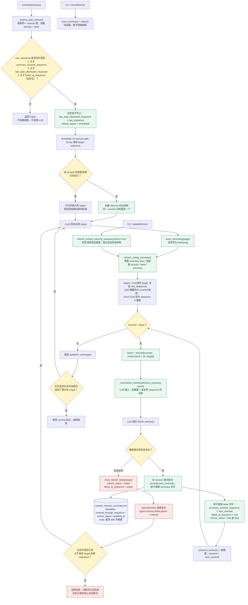

# 记忆链路

## 当前实现：请求链路与连续性回退

```mermaid
flowchart LR
    subgraph S1["1. 创建本次 Agent 上下文"]
        U["用户请求\nsession_id + goal"] --> RT["AgentRuntime._create_context()"]
        RT --> CM["ContextMemory(session memory path)"]
        CM --> LC["load_context()\n获取同一 session 锁"]
        LC --> RR["读取 context_memory.jsonl\n兼容 v1；按文件顺序补 sequence"]
        LC --> MSR["读取 memory_state.json\nraw / covered / attempted / failed / refresh status"]
        LC --> SSR["读取 context_memory_summary.md\n摘要正文 + covered sequence + source digest"]
        RR --> VALID{"摘要正文存在；state.covered > 0；\nsummary.covered == state.covered；\ndigest == records[:covered] 的 digest？"}
        MSR --> VALID
        SSR --> VALID
    end

    subgraph S2["2. 选择给模型的历史上下文"]
        VALID -->|"有效且 covered == raw"| ONLY["仅返回 300 字以内有效摘要"]
        VALID -->|"有效但 covered < raw"| DELTA["有效旧摘要\n+ records[covered:] 的原始回退"]
        VALID -->|"缺失、损坏或 digest 不匹配"| RAW["仅返回最近 10 条原始记录"]
        DELTA --> LIMIT["每条 question / final_answer 最多 600 字；\n总上下文最多 6,000 字"]
        RAW --> LIMIT
        ONLY --> CTX["AgentRunContext.context_memory"]
        LIMIT --> CTX
    end

    subgraph S3["3. 执行与成功提交"]
        CTX --> ENG["AgentLoopEngine.execute()\n只读取 context.context_memory\n不直接读写长期记忆"]
        ENG --> RES["EngineResult.answer"]
        RES --> SUCCESS{"Engine 是否成功返回？"}
        SUCCESS -->|否| FAILED["AgentRuntime 发布 agent.error / run.finished failed\n不写 JSONL，不调度摘要"]
        SUCCESS -->|是| REM["AgentRuntime._remember_success()"]
        REM --> APPEND["remember() 在 session 锁内追加 v2 记录\nschema_version / sequence / run_id / created_at / question / final_answer"]
        APPEND --> RAWFILE[("context_memory.jsonl")]
        APPEND --> DIRTY["更新状态：raw_sequence += 1；refresh_status = dirty"]
        DIRTY --> STATEFILE[("memory_state.json")]
        REM --> EVENT{"原始记录写入成功？"}
        EVENT -->|否| PERSISTERR["发布 agent.memory.failed\nphase = persist；仍返回本轮 answer"]
        EVENT -->|是| SCHEDULE["MemoryRefreshScheduler.schedule()"]
    end

    classDef read fill:#e8f1fb,stroke:#1d70b8,color:#102a43;
    classDef write fill:#e9f7ef,stroke:#198754,color:#0f5132;
    classDef decision fill:#fff4cc,stroke:#b7791f,color:#513c06;
    classDef failure fill:#fbe8e7,stroke:#c53030,color:#742a2a;
    class LC,RR,MSR,SSR,ONLY,DELTA,RAW,LIMIT read;
    class APPEND,DIRTY,REM,SCHEDULE write;
    class VALID,SUCCESS,EVENT decision;
    class FAILED,PERSISTERR failure;
```

`load_context()` 是连续性保证点：它只读取，不会写状态、不会发起后台任务；因此摘要未完成或失败时，下一次运行仍能从 JSONL 获得最近结果。

## 当前实现：后台滚动摘要与失败抑制

上述第二张图中，`CHECK` 是防循环的唯一自动调度门槛：读取路径、`CheckMemory`、回退路径均没有到达 `schedule()` 的边。

## 持久化文件职责

| 文件 | 职责 | 关键内容 |
| --- | --- | --- |
| `context_memory.jsonl` | 可追溯的原始记忆源 | `schema_version`、`sequence`、`run_id`、`created_at`、问答 |
| `context_memory_summary.md` | 注入给 Agent 的压缩上下文 | 摘要正文、覆盖序号、来源 digest |
| `memory_state.json` | 摘要一致性与防循环控制面 | 原始序号、已覆盖序号、尝试/失败版本、刷新状态 |

## 关键约束

- 只有“成功写入比已尝试版本更新的原始记录”才能触发自动刷新。
- 上下文读取、摘要过期检测、`CheckMemory` 和原始记录回退都不触发刷新。
- 摘要失败后，当前 `failed_at_sequence` 无新记录时禁止自动重试；手动 `UpdateMemory` 可强制刷新。
- 原始记录、状态和摘要元数据按 session 加锁；摘要与状态文件使用临时文件后原子替换。
- 摘要不可信或未覆盖全部记录时，优先保证连续性：向 Agent 提供有限的原始记录回退，而非静默读取过期摘要。

## 维护检查

变更记忆逻辑时确认：

1. 新的成功运行是否能在摘要尚未完成时被下一轮读取。
2. 摘要覆盖序号是否只前进、不倒退。
3. 刷新失败是否在无新增记录时保持抑制。
4. 并发运行是否仍能保持原始记录 sequence 连续。
